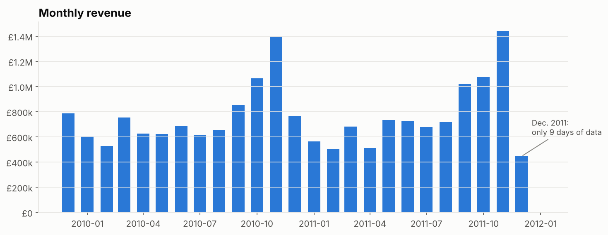

# 📈 E-commerce Sales Forecasting

> Forecasting the daily revenue of an online retailer (UCI Online Retail II, 1M+ transactions, 2009–2011) with machine learning, and serving the forecasts in an interactive Streamlit app.

🚧 **Work in progress**: step 1 (data cleaning & exploratory analysis) is done. Modeling and the Streamlit app are coming next.



## ✅ Step 1 – Data cleaning & EDA

Notebook: [`notebooks/01_eda.ipynb`](notebooks/01_eda.ipynb)

**Data quality** (1,067,371 raw lines → 996,488 clean product lines, 93.4% kept):
- 34,335 exact duplicates removed
- 19,104 cancellation lines removed, **plus 7,067 purchases cancelled afterwards** (matched on customer, product and quantity), e.g. an 80,995-unit order cancelled minutes later
- Postage, fees, discounts and gift vouchers removed (not product sales)
- 22.8% of lines have no customer ID: kept for revenue, excluded from customer analysis

**Key insights**
- **£19.1M revenue**, 39,227 orders, 5,833 customers, 4,886 products, 43 countries
- Strong **year-end seasonality**: revenue doubles in November (Christmas orders from wholesalers)
- **No sales on Saturdays**, orders placed during office hours: a B2B business
- The **UK makes 85.4%** of revenue; **21% of products make 80%** of revenue

## ▶️ Run it

```bash
pip install -r requirements.txt
python src/download_data.py      # downloads the raw data (45 MB) into data/raw/
python src/data_prep.py          # cleans the data and builds data/processed/daily_sales.csv
jupyter notebook notebooks/01_eda.ipynb
```

## 📁 Structure

```
├── data/processed/     # Clean daily sales (raw data is downloaded, not versioned)
├── notebooks/          # 01_eda.ipynb
├── reports/            # Figures and data quality report
└── src/                # Data download, cleaning and plotting code
```

---
**Author:** Yassine CHARIT · [LinkedIn](https://www.linkedin.com/in/yassine-charit/) · Data source: [UCI Machine Learning Repository](https://archive.ics.uci.edu/dataset/502/online+retail+ii)
