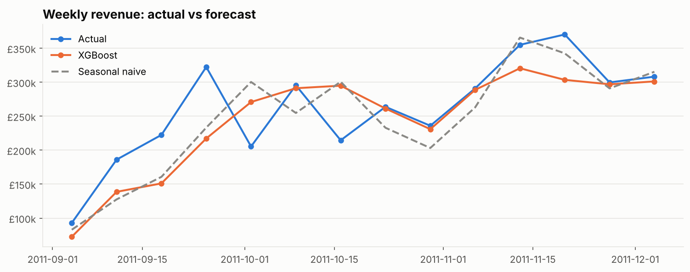
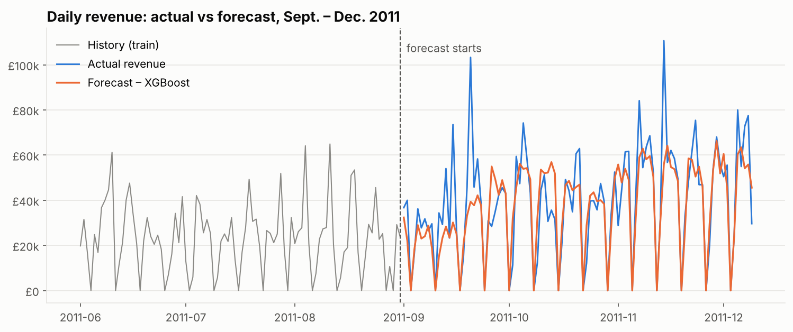

# 📈 E-commerce Sales Forecasting

> Forecasting the daily revenue of an online retailer (UCI Online Retail II, 1M+ transactions, 2009–2011) with machine learning, and serving the forecasts in an interactive Streamlit app.

🚧 **Work in progress**: data cleaning, EDA and forecasting models are done. The Streamlit app is coming next.



## ✅ Step 1 – Data cleaning & EDA

Notebook: [`notebooks/01_eda.ipynb`](notebooks/01_eda.ipynb)

**Data quality** (1,067,371 raw lines → 996,488 clean product lines, 93.4% kept):
- 34,335 exact duplicates removed
- 19,104 cancellation lines removed, **plus 7,067 purchases cancelled afterwards** (matched on customer, product and quantity), e.g. an 80,995-unit order cancelled minutes later
- Postage, fees, discounts and gift vouchers removed (not product sales)
- 22.8% of lines have no customer ID: kept for revenue, excluded from customer analysis

**Key insights**
- **£19.1M revenue**, 39,227 orders, 5,833 customers, 4,886 products, 43 countries
- Strong **year-end seasonality**: revenue doubles in November (Christmas orders from wholesalers)
- **No sales on Saturdays**, orders placed during office hours: a B2B business
- The **UK makes 85.4%** of revenue; **21% of products make 80%** of revenue

## ✅ Step 2 – Forecasting models

Notebook: [`notebooks/02_forecasting.ipynb`](notebooks/02_forecasting.ipynb) · Code: [`src/forecasting.py`](src/forecasting.py)

**Scenario:** at the end of August 2011, forecast every day of the Christmas season (**Sept. 1 – Dec. 9, 2011, 100 days, £4.0M of revenue**) in one go. Models using past revenue are run **recursively** (each forecast is fed back as input), like in real life.

**Features:** calendar (weekday, month, week, yearly sine/cosine), events (days to Christmas, UK bank holidays, closed days), recent level (lags 1/7/14/28 days, 7- and 28-day rolling means).

| Model | MAE (£/day) | RMSE | MAPE daily | MAPE weekly | Season total error |
|---|---|---|---|---|---|
| **XGBoost** | **10,877** | **15,556** | 27.1% | **15.3%** | -6.5% |
| Random Forest | 11,252 | 16,019 | 25.6% | 16.2% | -10.2% |
| Linear regression (Ridge) | 13,319 | 18,390 | 27.0% | 20.0% | -22.2% |
| Seasonal naive (same day last year) | 13,656 | 18,387 | 34.6% | 17.3% | -5.6% |

**Takeaways**
- **XGBoost reduces the daily error by 20%** vs the seasonal naive baseline, with a **weekly error of ~15%**, accurate enough for stock and staff planning.
- The linear model misses the non-linear November surge (-22% on the season).
- Daily errors remain high because of large one-off wholesale orders: the weekly level is the right one for decisions.
- Limits: only 2 years of history (one previous Christmas to learn from), no external data (promotions, prices).



## ▶️ Run it

```bash
pip install -r requirements.txt
python src/download_data.py      # downloads the raw data (45 MB) into data/raw/
python src/data_prep.py          # cleans the data and builds data/processed/daily_sales.csv
jupyter notebook notebooks/      # 01_eda.ipynb, then 02_forecasting.ipynb
```

## 📁 Structure

```
├── data/processed/     # Clean daily sales (raw data is downloaded, not versioned)
├── notebooks/          # 01_eda.ipynb, 02_forecasting.ipynb
├── reports/            # Figures and data quality report
└── src/                # Data download, cleaning, forecasting and plotting code
```

---
**Author:** Yassine CHARIT · [LinkedIn](https://www.linkedin.com/in/yassine-charit/) · Data source: [UCI Machine Learning Repository](https://archive.ics.uci.edu/dataset/502/online+retail+ii)
